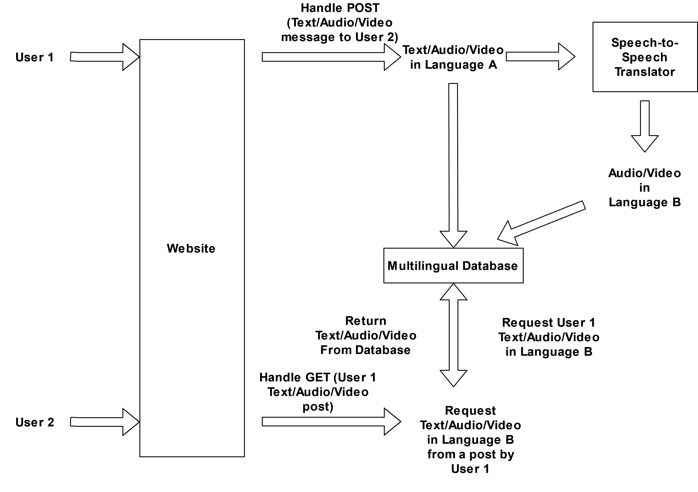

# Speech to Speech Translation to Facilitate Multilingual File Storage and User Networking

This project is a simple (and unsecure) prototypical message board where files are stored using a `multilingual database`, 
written using SQL. 
Using available packages (check `Related Resources`), we implement a simple translation system 
(check `Multilingual Database`) for translating text, audio, and video files. 
While text translation systems are readily available, audio translation systems are generally not. 
Leveraging *Speech-to-Text* transcription systems (like `Mozilla Deepspeech`), *Text-to-Text* translation systems 
(like `Google Translate`), and finally *Text-to-Speech* spoken-word systems (like `Google TTS`), 
we can readily translate both audio and visual files as well.

### Language Preference on a Social or Networking Site

Using such systems, we build a website where users are easily able to message each other in their preferred language 
and receive messages in their preferred language. As such, users of different linguistic heritages can easily and 
efficiently communicate with one another using audio or visual records or simply text messages. 

### Multilingual Representations  

# Website Layout and Design

This project has a minimalistic design using `HTML`, `Flask`, `AnjularJS`, and of course `Python`.
The user handling and session design were both built on using these resources. 

# The Multilingual Database

# Related Resources
Much of the website design was inspired by blogs, templates, and github repos. 

1. **SQL**: Users and Messages are stored in an SQL database. 
2. **Flask**: Flask is used to the framework, with templates and controllers for webpages to be able to exploit Flask's 
useful features as well as app management. 
3. **anjularJS**: To handle functionalities for buttons, recording messages, etc. exploits [anjularJS](https://realpython.com/handling-user-authentication-with-angular-and-flask/). 
4. Mozilla [**DeepSpeech**](https://github.com/mozilla/DeepSpeech)

# How to Run	

>Go into the head directory and run `python manage.py create_db` in a terminal. Then run `python manage.py runserver`. Go to http://localhost:5000/. Create a user and then send a new message to a different user. 
