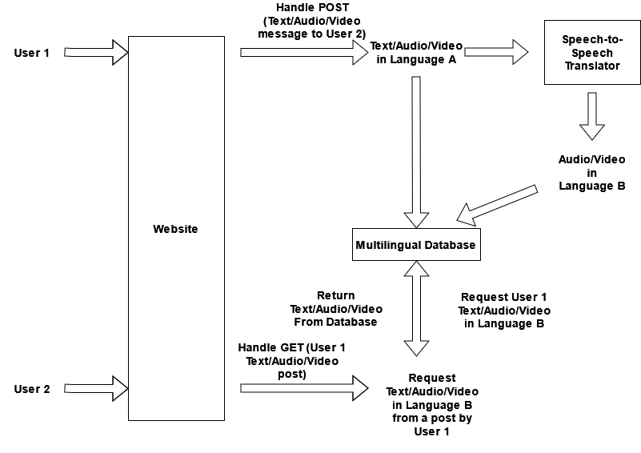

# Speech to Speech Translation to Facilitate Multilingual File Storage and User Networking

This project is a simple (and unsecure) prototypical message board where files are stored using a `multilingual database`, 
written using SQL. 
Using available packages (check `Related Resources`), we implement a simple translation system 
(check `Multilingual Database`) for translating text, audio, and video files. 
While text translation systems are readily available, audio translation systems are generally not. 
Leveraging *Speech-to-Text* transcription systems (like `Mozilla Deepspeech`), *Text-to-Text* translation systems 
(like `Google Translate`), and finally *Text-to-Speech* spoken-word systems (like `Google TTS`), 
we can readily translate both audio and visual files as well.

##### Language Preference on a Social or Networking Site

Using such systems, we build a website where users are easily able to message each other in their preferred language 
and receive messages in their preferred language. 
As such, users of different linguistic heritages can easily and efficiently communicate with one another using audio 
or visual records or simply text messages. 
They can "check" their messages by going to their message board, where all the messages they sent are represented, ordered by date. 
The messages appear in both the language of the sender and the receiver. 

##### Multilingual Representations  

In the backend (check `Multilingual Database`), we have a database that stores the messages of the users. 
The database is written in SQL, using flask SQL alchemy. 
We store both the original video, audio, or text and its accompanying translated pair.
At the moment of creation, brought by POST request, the translation occurs following the `Translation Pipeline` shown 
in the `Multilingual Database` section.

# How to Run	

>Clone this repo and run `cd ./gsoc-sp2sp-net/`, then `python setup_with_py.py` in a terminal. 
Then run `python full_clean.py`. Go to http://localhost:5000/. 
Create two users with different languages and then send a message from one to the other. 
Then check the message board of either user. Check out `manage.py`.

# Related Resources
Much of the website design was inspired by blogs, templates, and github repos. 

1. **SQL-alchemy**: Users and Messages are stored in an SQL database and are managed using flask SQL alchemy.  
2. **Flask**: Flask is used to the framework, with templates and controllers for webpages to be able to exploit Flask's 
useful features as well as app management. 
3. **anjularJS**: To handle functionalities for buttons, recording messages, etc. exploits [**anjular**](https://realpython.com/handling-user-authentication-with-angular-and-flask/) [**JS**](https://github.com/realpython/flask-angular-auth).
4. Mozilla [**DeepSpeech**](https://github.com/mozilla/DeepSpeech)
5. **WebRTC**: To handle visual and audio recording. Handling recordings was done from [**RecordRTC.js**](https://github.com/muaz-khan/RecordRTC/blob/master/RecordRTC.js).

# Website Layout and Design

This project has a minimalistic design using `HTML`, `Flask`, `AnjularJS`, and of course `Python`.
The user handling and session design were both built on resources in the `Related Resources` section.

# The Multilingual Database

The database is written in SQL, using flask SQL alchemy. It stores the path to the files that have the original
content. The naming of the files has the following form: year_month_date_hour_minute_second_messagetype_sendername_receivername_ 

## Translation Pipeline

